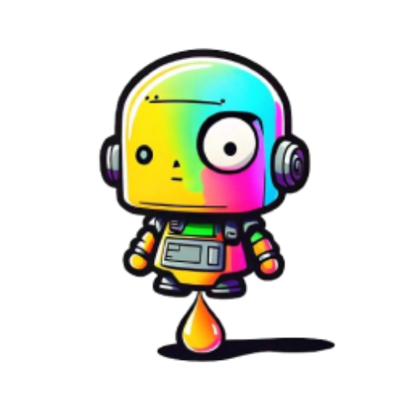

<div align="center">
  
</div>

# AI Juicebox

A collection of local AI tools to get things done. Chat is useful but not enough, check out our other tools. I find it unfair that the big guys have tools and not the open source ones. This is an attempt to make a collection of tools that are useful and private.

## Features

- Chat with an AI
- Search for documents
- Search the web
- Co-author text
- Prompt sequences
- And more

## Getting Started

To get started, you can either download the app from the releases page or you can clone this repository and run the app locally.

[Download the app](https://github.com/desduvauchelle/ai-juicing-juicebox/releases)

## Why AI Juicebox?

An extendable experimentation of using AI to accomplish tasks. From the chat interface that you probably already know, to document searching, web searching, co-authoring text, prompt sequences, and more. All this using local models, keeping the information private and secure on your computer.

I really hope that the future of AI is open source and private. This project is a step in that direction.

This is an electron app that will either install and run Ollama on your computer or you can use a remote version of Ollama. It is installed like an application on your computer. You can check the console and network tab in the developer tools to see that is to no interaction with any server other than the AI one. Nothing is stored in the cloud either, all your chats are stored on the app storage (IndexedDB).

### Prerequisites

We don't install Ollama for you yet. But you can add the Ollama server URL from your current computer or from a remote URL.

## Development status

This project is in early development. It is not ready for production use. It is not ready for general use. It is not ready for any use. It is not ready for anything. It is not ready.

## Self build

To build the app yourself, you can clone the repository and run the following commands:

```bash
# Clone the repository
yarn install
yarn start
```

## Built With

```bash
yarn package
```

## Contributing

Community contributions are welcome, especially in testing and packaging. Contribute via issues and pull requests.

## Todo

- [ ] Onboarding revamp
- [ ] Add Ollama server installation
- [ ] Add any AI services to use
- [ ] Finish the Canvas interface
- [ ] Add a web search
- [ ] Add a web scrapping
- [ ] Add a document to answer
- [ ] Add an auto-updater
- [ ] Set up and connect remote server

## Wishlist

- [ ] Add a way to generate images (ideally locally, but remote also an option)
